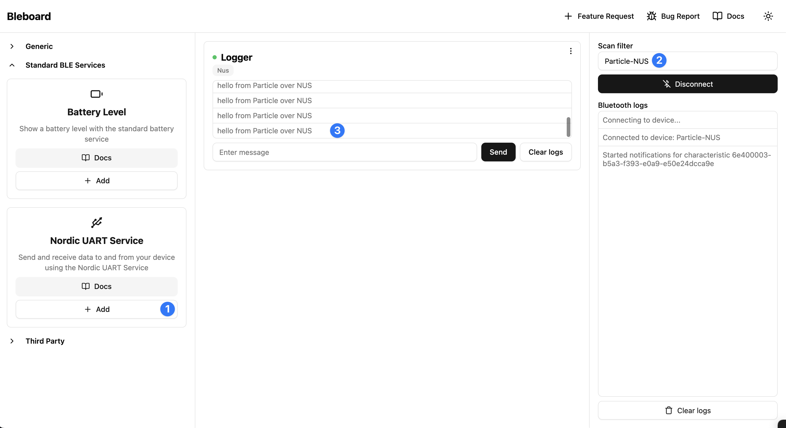

# BLE Nordic UART Service (NUS)

**Difficulty:** Beginner

**Estimated Time:** 15–20 minutes

**Hardware Needed:** Particle device with BLE (e.g., P2), USB cable

---

### Overview

This tutorial shows how to turn a Particle device into a BLE peripheral using the **Nordic UART Service (NUS)**. NUS is a common BLE profile that acts like a serial link: a central (phone, tablet, or another device) can write data to your device and receive notifications from it. You will advertise the NUS service, handle incoming writes on the RX characteristic, and send periodic messages on the TX characteristic to any connected central.

---

### Tools & Materials

- Particle device with BLE (e.g., Photon 2)
- USB cable
- Particle Workbench or CLI installed
- Optional: BLE serial app on a phone (e.g., nRF Connect, Serial Bluetooth Terminal) to test

---

### Dependencies

- Device OS with BLE support (no additional libraries required)

---

### Steps

1. **Clone this repository:**

   ```bash
   git clone https://github.com/particle-iot/blueprint-beginner-ble-nus.git
   cd blueprint-beginner-ble-nus
   ```

2. **Open the project** in Particle Workbench or your preferred editor.

3. **Flash to your device:**

   - Configure the project for your device (e.g., P2) using Particle Workbench and the command palette (Ctrl/Cmd + Shift + P):
      
   - Select your device model and Device OS release:
      
      

4. **Open a serial terminal:**

   - Choose `Particle: Serial monitor` from the command palette:
      

5. **Connect with a BLE central** (e.g., nRF Connect or a BLE serial app), connect to "Particle-NUS", and write to the RX characteristic. You should see the data printed in the serial monitor. The device will send "hello from Particle over NUS" to the central about once per second while connected.

   - Use a NUS compatible app such as [Adafruit's Bluefruit LE Connect](https://learn.adafruit.com/bluefruit-le-connect/ios-setup) (for iOS or Android) or [bleboard](https://dashboard.bleboard.com) (for WebBLE).
   - Connect and view the "hello from Particle over NUS" logs start to stream in.
      
   - Try sending a command to the device and view it printed back over the serial port
      [!serial port](./images/serial-callback.png)

---

### How It Works

- The firmware uses the standard **NUS UUIDs** (6E400001… for the service, 6E400002 for RX, 6E400003 for TX).
- **RX characteristic** (write): When a central writes data to RX, the `onNusRx` callback runs and prints the received bytes to Serial.
- **TX characteristic** (notify): Subscribed centrals receive notifications. In `loop()`, once per second when BLE is connected, the code updates the TX value with `"hello from Particle over NUS\n"`, which triggers a notification to all subscribed centrals.
- The device advertises with the local name "Particle-NUS" and the NUS service UUID so scanners can discover it easily.

---

### Topics Covered

- [BLE (Bluetooth Low Energy)](https://docs.particle.io/reference/device-os/firmware/#ble-object) on Particle
- [BleCharacteristic](https://docs.particle.io/reference/device-os/firmware/#blecharacteristic) (NOTIFY and WRITE)
- [BleAdvertisingData](https://docs.particle.io/reference/device-os/firmware/#bleadvertisingdata) (local name and service UUID)
- Nordic UART Service (NUS) profile
- Serial output for debugging

---

### Extensions

- Echo received bytes back over the TX characteristic instead of a fixed message.
- Add a simple command parser (e.g., turn an LED on/off via BLE).
- Use a second Particle device as a BLE central to talk to this peripheral.
